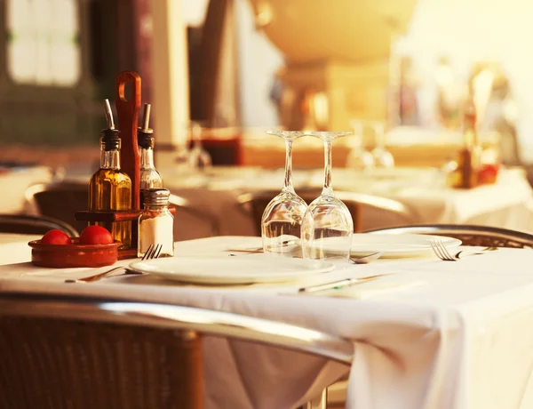

# Restaurant Fictif - Le Saint Sauvage

This is a **Next.js** project bootstrapped with [`create-next-app`](https://github.com/vercel/next.js/tree/canary/packages/create-next-app).

---

## 🚀 Features

- **Hero Banner**: A welcoming section with a background image, a main title, and interactive buttons.
- **Interactive Menu**: Dynamic display of menu categories (Starters, Main Courses, Desserts) with descriptions and prices.
- **Responsive Design**: Fully responsive for all screen sizes (mobile, tablet, desktop).
- **Modern Styling**: Built with Tailwind CSS for fast and consistent design.

---

## 🛠️ Technologies Used

- **React**: JavaScript framework for building user interfaces.
- **Next.js**: React framework for server-side rendering and static site generation.
- **Tailwind CSS**: Utility-first CSS framework for responsive design.
- **JSON**: Used to store menu data.
- **JavaScript (ES6)**: Main language for application logic.

---

## 📂 Project Structure

```
restaurant_fictif/
├── public/
│   ├── images/                # Images used in the project
│   │   └── restau_image.jpg   # Background image for the banner
│   ├── menu.json              # Menu data
├── src/
│   ├── app/
│   │   ├── components/
│   │   │   ├── herroBanner/   # Hero Banner component
│   │   │   │   └── HerroBanner.js
│   │   │   ├── menu/          # Menu component
│   │   │   │   └── Menu.js
│   │   │   ├── button/        # Button component
│   │   │   │   └── Button.js
│   │   └── globals.css        # Global CSS file
├── README.md                  # Project documentation
├── package.json               # Project dependencies and scripts
```

---

## ⚙️ Installation

1. **Clone the project**:

      ```bash
      git clone https://github.com/your-repo/restaurant_fictif.git
      cd restaurant_fictif
      ```

2. **Install dependencies**:

      ```bash
      npm install
      ```

3. **Run the development server**:

      ```bash
      npm run dev
      ```

4. **Open the app**:
   Open [http://localhost:3000](http://localhost:3000) in your browser to see the result.

---

## 📋 Usage

### 1. **Hero Banner**

- Displays a background image with a main title and subtitle.
- Two interactive buttons:
     - **Discover the Menu**: Redirects to the menu section.
     - **Reserve a Table**: Can be configured to open a reservation form.

### 2. **Menu**

- Displays menu categories (Starters, Main Courses, Desserts).
- Data is dynamically loaded from the `menu.json` file.

---

## 📸 Preview

### Hero Banner



### Menu


---

## 🛠️ Customization

### Modify Menu Data

- Menu data is stored in `public/menu.json`.
- Example structure:
     ```json
     {
     	"menu": {
     		"starters": [
     			{
     				"id": 1,
     				"name": "Caesar Salad",
     				"price": 8.5,
     				"description": "A classic salad with lettuce, croutons, parmesan, and Caesar dressing."
     			}
     		]
     	}
     }
     ```

### Modify Styles

- Global styles are defined in `src/app/globals.css`.
- Use Tailwind CSS utility classes to customize components.

---

## Learn More

To learn more about Next.js, take a look at the following resources:

- [Next.js Documentation](https://nextjs.org/docs) - learn about Next.js features and API.
- [Learn Next.js](https://nextjs.org/learn) - an interactive Next.js tutorial.

You can check out [the Next.js GitHub repository](https://github.com/vercel/next.js) - your feedback and contributions are welcome!

---

## 📄 License

This project is licensed under the MIT License. You are free to use, modify, and distribute it.

---

## ✨ Author

- **Name**: Your Name
- **Contact**: [Your Email or LinkedIn Profile]

---

With this updated `README.md`, your project is well-documented and ready to be shared!
